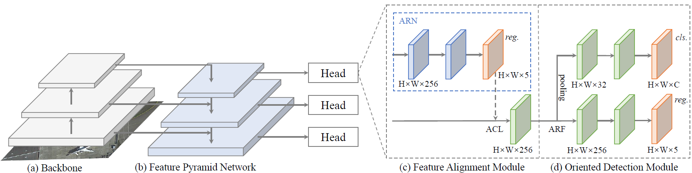

### Align Deep Features for Oriented Object Detection



> **[Align Deep Features for Oriented Object Detection](https://arxiv.org/abs/2008.09397)**,            
> Jiaming Han<sup>\*</sup>, Jian Ding<sup>\*</sup>, Jie Li, Gui-Song Xia<sup>†</sup>,        
> arXiv preprint ([arXiv:2008.09397](https://arxiv.org/abs/2008.09397)) / TGRS ([IEEE Xplore](https://ieeexplore.ieee.org/document/9377550)).

The repo is based on [mmdetection](https://github.com/open-mmlab/mmdetection), [S2ANet](https://github.com/csuhan/s2anet/tree/pytorch1.9) branch pytorch1.9, and [UCAS-AOD-benchmark](https://github.com/ming71/UCAS-AOD-benchmark) thanks to their work.

Two versions are provided here: [Original version](https://github.com/csuhan/s2anet/tree/original_version) and [v20210104](https://github.com/csuhan/s2anet). We recommend to use [v20210104](https://github.com/csuhan/s2anet) (i.e. the master branch).

## Introduction
As there is a need for me to run S2ANet on UCAS_AOD. However, there is no present work to do this. This repo is both a tutorial and an extension to original project [S2ANet](https://github.com/csuhan/s2anet/tree/pytorch1.9). Besides, I used [UCAS-AOD-benchmark](https://github.com/ming71/UCAS-AOD-benchmark) to prepare for dataset.

The main problems this repo solved are:
- [x] custom dataset training(UCAS_AOD as an example)
- [x] change the backbone to ResNeXt101x64_4d to gain more performance.(this pretrain model is provided in the link below, after downloading, move it to torch pretrain cache dir)
- [x] a tutorial for begineers in remote-sensing
- [x] provide some pretrained models with baidu Netdisk
- [ ] align the accuracy provided in [UCAS-AOD-benchmark](https://github.com/ming71/UCAS-AOD-benchmark) (The Reason might be training params for I only have RTX3060 12G)

## Results for UCAS_AOD
|  class   | ap  |
|  ----  | ----  |
| car  | 80.75557185 |
| airplane  | 90.64514424 |
pretrained model file can be downloaded [here](https://pan.baidu.com/s/1YPeQjtGmXZQhuHWGC3DaMg). code: 0lsj 
## Tutorial for custom training
files to be added :
- DOTA_devkit/ucas_aod_evaluation.py
- mmdet/datasets/UCAS_AOD.py
- tools/test.py
- configs/ucasaod/*

The first one is used when evaluating.\
The second one is for loading custom dataset(like this directory in UCAS_AOD_Benchmark).\
The third is adding params for evaluating.\
The fourth is config file for training.

## Something Important to be noticed
- 1.the processed dataset anno filed(.txt) have 14 cols, and they are $class,x_1,y_1,x_2,y_2,x_3,y_3,x_4,y_4,theta,x,y, width,height$. And theta is angle not arc(see here).

## Citation

```
@article{han2021align,  
  author={J. {Han} and J. {Ding} and J. {Li} and G. -S. {Xia}},  
  journal={IEEE Transactions on Geoscience and Remote Sensing},   
  title={Align Deep Features for Oriented Object Detection},   
  year={2021}, 
  pages={1-11},  
  doi={10.1109/TGRS.2021.3062048}}

@inproceedings{xia2018dota,
  title={DOTA: A large-scale dataset for object detection in aerial images},
  author={Xia, Gui-Song and Bai, Xiang and Ding, Jian and Zhu, Zhen and Belongie, Serge and Luo, Jiebo and Datcu, Mihai and Pelillo, Marcello and Zhang, Liangpei},
  booktitle={Proceedings of the IEEE Conference on Computer Vision and Pattern Recognition},
  pages={3974--3983},
  year={2018}
}

@InProceedings{Ding_2019_CVPR,
  author = {Ding, Jian and Xue, Nan and Long, Yang and Xia, Gui-Song and Lu, Qikai},
  title = {Learning RoI Transformer for Oriented Object Detection in Aerial Images},
  booktitle = {The IEEE Conference on Computer Vision and Pattern Recognition (CVPR)},
  month = {June},
  year = {2019}
}

@article{chen2019mmdetection,
  title={MMDetection: Open mmlab detection toolbox and benchmark},
  author={Chen, Kai and Wang, Jiaqi and Pang, Jiangmiao and Cao, Yuhang and Xiong, Yu and Li, Xiaoxiao and Sun, Shuyang and Feng, Wansen and Liu, Ziwei and Xu, Jiarui and others},
  journal={arXiv preprint arXiv:1906.07155},
  year={2019}
}
```
